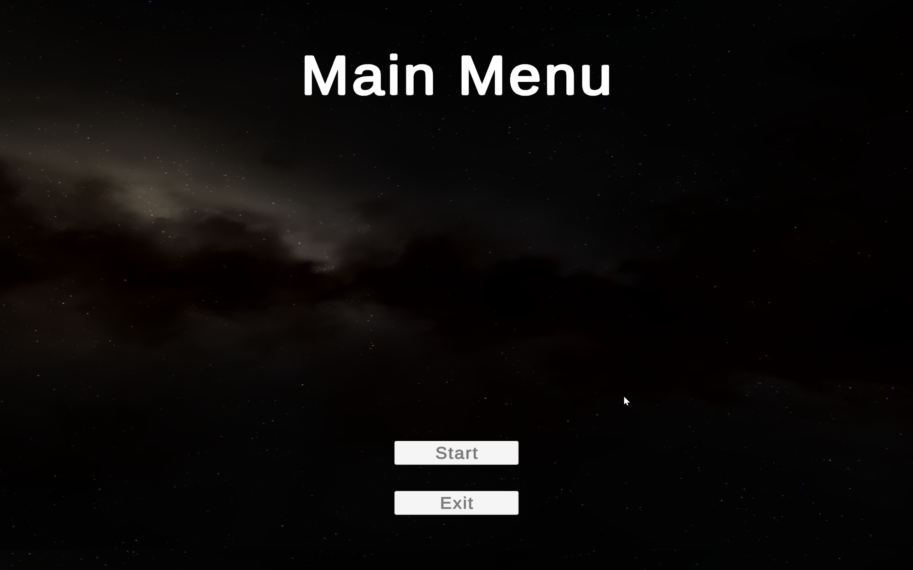
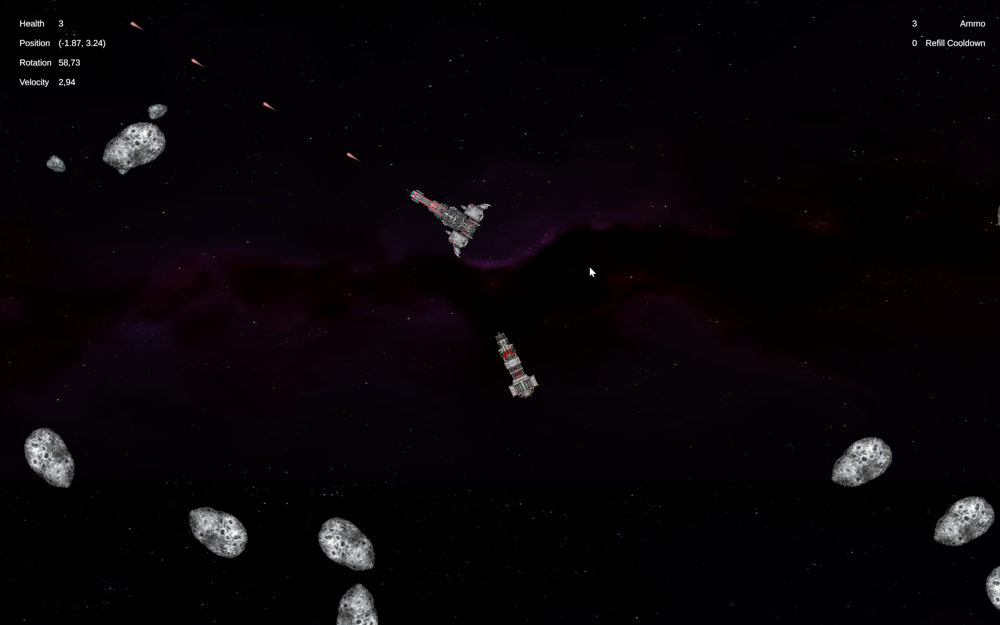
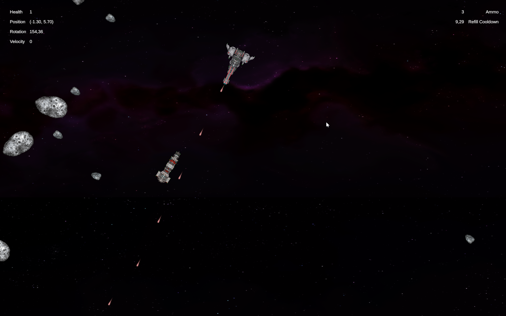
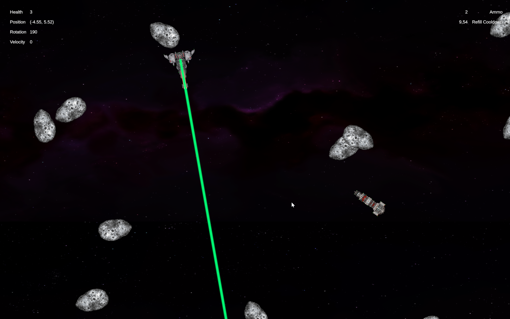
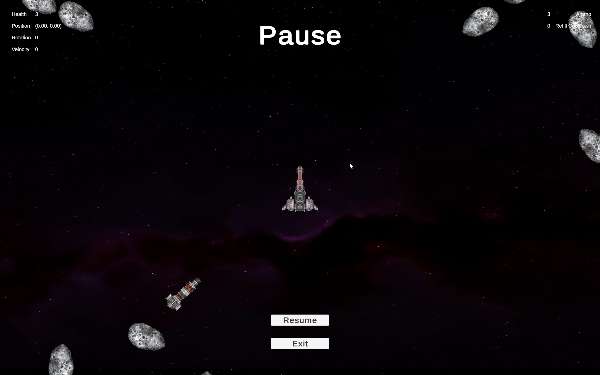
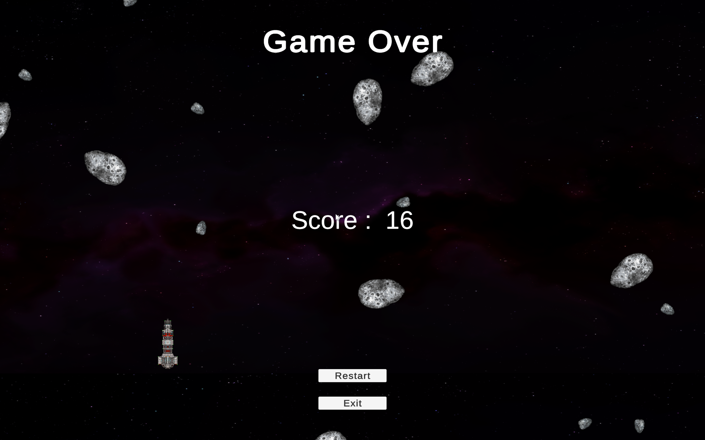

# Intro
This is my pet project where I was playing around with different aprouches, patterns, frameworks etc. There are different implementations of [asteroids game](https://en.wikipedia.org/wiki/Asteroids_(video_game)) in commit history and across various branches. 

Idea of creating such a game originally came from [this video](https://www.youtube.com/watch?v=syvjmS-mflY&t=1249s) where author was implementing project according to [those requirements](https://docs.google.com/document/d/1_2FPU2l_L7s5MPc9GJwN6QKcRNTRWgqKJasJ07PMXbY/edit#heading=h.92by3zo281gq). 

But I decided to go a bit beyond those requirements and try to provide an easy to maintain and scalable architecture.

# GamePlay
[Here](https://youtu.be/EyfP4JsrVl0) you can find a live gameplay demo.

# Dependencies
Main branch (which I consider the best) represents an implementation based on:
- [Zenject](https://github.com/modesttree/Zenject)
- [LeoEcsLite](https://github.com/Leopotam/ecslite)
  - [LeoEcsLite-Extendedsystems](https://github.com/Leopotam/ecslite-extendedsystems)
  - [LeoEcsLite-Unityeditor](https://github.com/Leopotam/ecslite-unityeditor)
  - [LeoEcsLite-Physics](https://github.com/supremestranger/leoecs-lite-physics)
  - [LeoEcsLite-unity-ugui](https://github.com/Leopotam/ecslite-unity-ugui)
- [UniTask](https://github.com/Cysharp/UniTask/tree/master)
- [Addressables](https://docs.unity3d.com/Packages/com.unity.addressables@1.21/manual/index.html)
- [Newtonsoft Json](https://docs.unity3d.com/Packages/com.unity.nuget.newtonsoft-json@3.2/manual/index.html)
  
# Supported platforms
- PC

# Controls
- **W** - Accelerate
- **A** - Rotate Left
- **D** - Rotate Right
- **Left Click** - Primary Weapon Attack
- **Right Click** - Secondary Weapon Attack
- **Esc** - Pause

# ScreenShots

  
  
  
  
  
  

